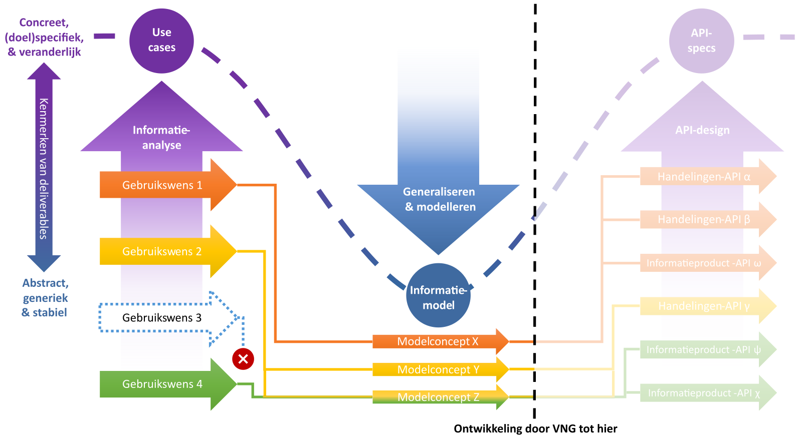

# Architectuur

## Uitgangspunten bij ontwerp van API-specificaties

### Issues bij eerste generatie API-specificaties

Het traject dat het materiaal op deze website produceerde, had tot doel API-specificaties te ontwikkelen die een aantal problemen van eerste generatie VNG-API-specificaties wegnemen.

Issues op het gebied van bijhouding (of het 'schrijven' van gegevens) waren:
- het ontbreken van mechanismen on transactionele integriteit te waarborgen;
- onvolledige standaardisatie op de manier waarop bepaalde handelingen worden uitgevoerd, en
- de onmogelijkheid betekenisvolle notificaties te versturen.

Bij levering (of het 'lezen' van gegevens) ontstonden performanceproblemen na opvragen van één vanuit businessperspectief logisch samenhangende gegevensset. Dit als gevolg van:
- 'kleine' resources leidden tot veel bevragingen en dus netwerkcalls, en
- 'kleine' registercomponenten vereisen het integreren van gegevens uit meerdere bronnen.

### Gegevensgedreven en informatieproductgebaseerd

De hypothese was dat handelingsgedreven bijhoudings-API's de bijhoudingsissues konden oplossen. Binnen dit patroon sluiten resources sluiten nauw aan bij ‘businesshandelingen’ die door mensen of geautomatiseerde systemen worden uitgevoerd. Hierdoor wordt een belangrijk deel van de mogelijke interpretatieverschillen weggenomen over welke gegevens bij een bepaalde handeling in welke volgorde en samenhang worden vastgelegd.

Consistentie tussen in het register opgeslagen gegevens kan worden gewaarborgd door één handeling in één transactie te registeren. En de geregistreerde 'handeling' kan dienen als basis voor betekenisvolle notificaties die door andere systemen kunnen worden verwerkt. Een [eerste verkenning](./api_familie_klantinteracties/klantinteracties.md#handelingsgedreven-bijhoudings-api) laat zien hoe API-specificaties volgens dit patroon eruit zouden kunnen zien.

Voor het oplossen van de problemen bij levering van gegevens was gedacht aan informatieproductgebaseerde bevragings-API's. Deze zouden, mogelijk gebaseerd op een los van het bijhoudingsmodel staand 'leesmodel' ([CQRS-patroon](https://martinfowler.com/bliki/CQRS.html)) en gebruikmakend van een specifiek voor dit doel geschikte API-stijl (zoals [GraphQL](https://graphql.org/)), bij de gebruiksbehoefte van afnemers aansluitende 'afgepaste' gegevenssets moeten leveren.

### Modelconcepten specificeren en concretiseren

De hierboven beschreven oplossingsrichtingen betekenen dat het nadrukkelijk de bedoeling was in het [informatiemodel](./../informatiemodel/semantisch_model.md) 'geabstraheerde' concepten voor de buitenwereld op een meer concrete vorm zichtbaar te maken. Om redenen van bondigheid, flexibel gebruik en (model)stabiliteit zeer generiek beschreven objecttype als 'digitaal adres' zou in een API-interface dus 'gewoon' als telefoonnummer of e-mailadres gepresenteerd kunnen worden. Hetzelfde geldt voor concepten als 'productaanvraag' of 'verzoek', waarvoor in een interface niet zichtbaar hoeft te zijn dat ze [als klantcontact met één of meerdere bijlagen](./../basisterminologie.md#product-aangevraagd-door-organisatie-die-persoon-vertegenwoordigt) gepersisteerd worden.

De afbeelding hieronder laat de niet helemaal afgelopen route zien van concrete, (doel)specifieke en veranderlijke use cases via een abstract, generiek en stabiel informatiemodel naar weer concrete, (doel)specifieke en veranderlijke API-specificaties.

