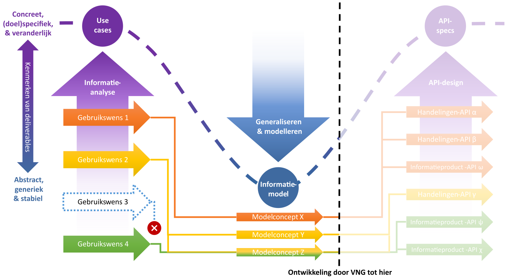

# Klantinteracties

## Geen standaard

De materialen op deze website zijn **niet** als standaard vastgesteld. Het is dus niet aanbevolen of verplicht ze te gebruiken.

## Vrij te gebruiken halfproduct

De op deze website gepubliceerde klantinteractiesmaterialen werden ontwikkeld als onderdeel van een onderzoekstraject naar nieuwe patronen voor API-specificaties. Het was de bedoeling dit traject af te ronden met een praktijkbeproeving van deze patronen aan de hand van de klantinteracties-casus. Daaruit zou later eventueel een gemeentelijke standaard kunnen ontstaan. Uiteindelijk bleek het voor zo'n toets in praktijkomstandigheden te vroeg.

Op dit moment (juli 2024) hebben andere vraagstukken prioriteit, waardoor er niet aan klantinteracties gewerkt kan worden. Het hier en in de [GitHub-repository](https://github.com/VNG-Realisatie/klantinteracties/) gepubliceerde materiaal geldt derhalve als halfproduct, dat 'as is, where is' onder de voorwaarden van de [EUPL](https://eupl.eu/1.2/nl/) te gebruiken is.

Géén van de onderdelen hieronder is voldoende gevalideerd om een 1.0-versieaanduiding te verdienen. Evengoed kennen individuele klantinteractiesonderdelen een verschillende mate van volwassenheid:

1. Het [semantisch informatiemodel](./informatiemodel/semantisch_model.md) is ontstaan naar aanleiding van discussie met verschillende gemeenten en leveranciers en in een aantal iteraties verbeterd. Hoewel het model niet in productieomstandigheden is beproefd, denken we dat dit het als basis voor verdere ontwikkelingen bruikbaar is.
2. Ondersteunde documentatie ([basisterminologie](./basisterminologie.md), [uitgangspunten](./achtergronddocumentatie/uitgangspunten.md), [casussen](./achtergronddocumentatie/cases.md), [functies](./achtergronddocumentatie/functies.md) en [vragen en besluiten](./achtergronddocumentatie/Vragen%20en%20besluiten.md)) is zoveel mogelijk consistent met het informatiemodel.
3. De [API-specificaties](./api_familie_klantinteracties/klantinteracties.md) zijn gemaakt om te laten zien hoe het model volgens verschillende API-ontwerppatronen naar specificaties zou kunnen worden vertaald. Deze specificaties zijn *niet* ontwikkeld voor praktijkgebruik, en kunnen dus *alleen* gebruikt worden als inspiratiebron.

## Wat hadden we willen doen?

### Bevindingen bij eerste generatie API-specificaties

Het traject dat het materiaal op deze website produceerde, had tot doel API-specificaties te ontwikkelen die een aantal problemen van eerste generatie VNG-API-specificaties wegnemen.

Issues op het gebied van bijhouding (of het 'schrijven' van gegevens) waren:
- het ontbreken van mechanismen on transactionele integriteit te waarborgen;
- onvolledige standaardisatie op de manier waarop bepaalde handelingen worden uitgevoerd, en
- de onmogelijkheid betekenisvolle notificaties te versturen.

Bij levering (of het 'lezen' van gegevens) ontstonden performanceproblemen na opvragen van één vanuit businessperspectief logisch samenhangende gegevensset. Dit als gevolg van:
- 'kleine' resources leidden tot veel bevragingen en dus netwerkcalls, en
- 'kleine' registercomponenten vereisen het integreren van gegevens uit meerdere bronnen.

### Gegevensgedreven en informatieproductgebaseerd

De hypothese was dat handelingsgedreven bijhoudings-API's de bijhoudingsissues konden oplossen. Binnen dit patroon sluiten resources sluiten nauw aan bij ‘businesshandelingen’ die door mensen of geautomatiseerde systemen worden uitgevoerd. Hierdoor wordt een belangrijk deel van de mogelijke interpretatieverschillen weggenomen over welke gegevens bij een bepaalde handeling in welke volgorde en samenhang worden vastgelegd.

Consistentie tussen in het register opgeslagen gegevens kan worden gewaarborgd door één handeling in één transactie te registeren. En de geregistreerde 'handeling' kan dienen als basis voor betekenisvolle notificaties die door andere systemen kunnen worden verwerkt. Een [eerste verkenning](./api_familie_klantinteracties/klantinteracties.md#handelingsgedreven-bijhoudings-api) laat zien hoe API-specificaties volgens dit patroon eruit zouden kunnen zien.

Voor het oplossen van de problemen bij levering van gegevens was gedacht aan informatieproductgebaseerde bevragings-API's. Deze zouden, mogelijk gebaseerd op een los van het bijhoudingsmodel staand 'leesmodel' ([CQRS-patroon](https://martinfowler.com/bliki/CQRS.html)) en gebruikmakend van een specifiek voor dit doel geschikte API-stijl (zoals [GraphQL](https://graphql.org/)), bij de gebruiksbehoefte van afnemers aansluitende 'afgepaste' gegevenssets moeten leveren.

### Modelconcepten specificeren en concretiseren

De hierboven beschreven oplossingsrichtingen betekenen dat het nadrukkelijk de bedoeling was in het informatiemodel 'geabstraheerde' concepten voor de buitenwereld op in een meer concrete vorm zichtbaar te maken. Om redenen van bondigheid, flexibel gebruik en (model)stabiliteit extreem generiek beschreven objecttype als 'digitaal adres' zou in een API-interface dus 'gewoon' als telefoonnummer of e-mailadres gepresenteerd kunnen worden. Hetzelfde geldt voor concepten als 'productaanvraag' of 'verzoek', waarvoor in een interface niet zichtbaar hoeft te zijn dat ze als klantcontact met één of meerdere bijlagen gepersisteerd worden.

De afbeelding hieronder laat de niet helemaal afgelopen route zien van concrete, (doel)specifieke en veranderlijke use cases via een abstract, generiek en stabiel informatiemodel naar weer concrete, (doel)specifieke en veranderlijke API-specificaties.

## Beheer en ondersteuning

De materialen op deze website worden niet beheerd. Verzoeken voor nieuwe functionaliteit worden daarom niet behandeld. Mail bij vragen over gepubliceerd materiaal naar [standaarden.ondersteuning@vng.nl](mailto:standaarden.ondersteuning@vng.nl).

## Licentie

Copyright &copy; VNG Realisatie 2024. Licensed under the [EUPL](https://eupl.eu/1.2/en/).
