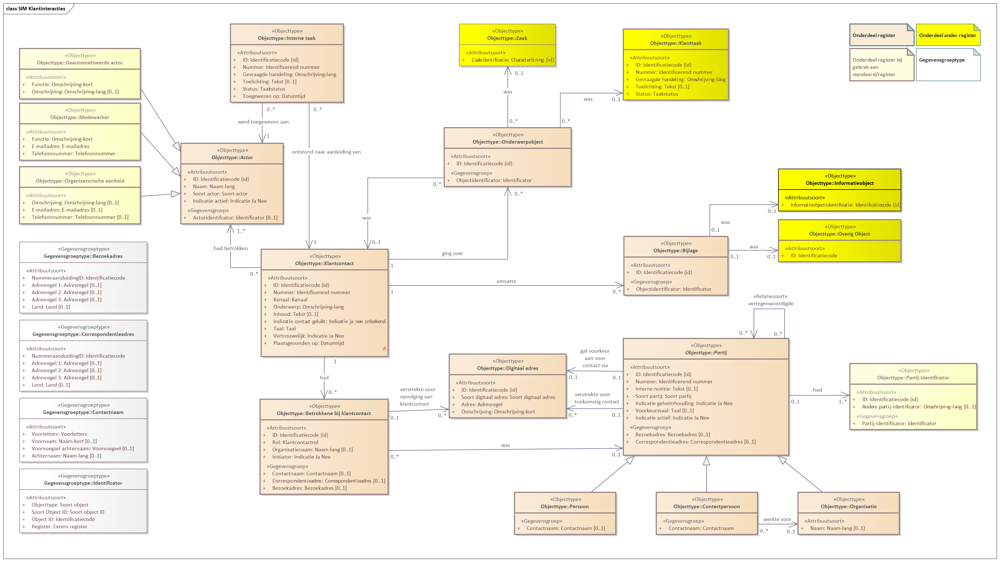

# Conceptueel informatiemodel

## Modellering in Enterprise Architect
Binnen VNG Realisatie wordt Enterprise Architect (EA) gebruikt voor de vastlegging van conceptuele informatiemodellen (CIM). Onderstaande figuur geeft het CIM weer zoals dit in EA is gemodelleerd.
Dit is de 6e versie van het informatiemodel dat is gepubliceerd. De vorige versies, inclusief een opsomming van de wijzigingen is [hier](./conceptueel_model_oud.md) te vinden.

